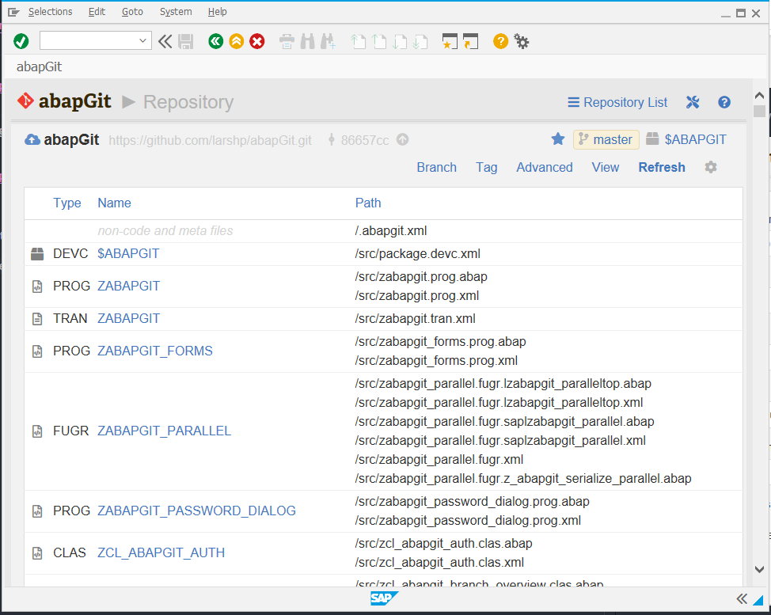

<!--img src="img/logo.svg#gh-light-mode-only" height="40" alt="abapGit logo"> 
# 
<a href="https://supportukrainenow.org/"> Support Ukraine</a>

Git client for ABAP

Works with: [GitHub](https://github.com/),
[GitLab](https://gitlab.com/),
[Assembla](https://www.assembla.com/git/),
[Bitbucket](https://bitbucket.org/),
[abapGitServer](https://github.com/larshp/abapGitServer),
[AWS](https://aws.amazon.com/codecommit/),
[TFS](https://www.visualstudio.com/team-services/git/),
[Azure DevOps](https://azure.microsoft.com/en-us/services/devops) and more.

ABAP Version: 702 or higher

Latest build: [zabapgit_standalone.prog.abap](https://raw.githubusercontent.com/abapGit/build/main/zabapgit_standalone.prog.abap)

*Notes: Some people reported that browsers have issues displaying the file with more than 100k lines. The easiest solution is to "Save as" the link above and then open it with any editor/viewer (notepad included) and copy from there. If your SAP GUI editor freezes when pasting the code, use Utilities > More Utilities > Upload/Download > Upload in the editor instead.*

It is recommended to use SAP GUI for Windows, since there are known issues related to running abapGit and SAP GUI for Java. The focus of abapGit is on supporting [ADT](https://github.com/abapGit/ADT_Frontend) instead of supporting SAP GUI for Java.

## Design Goals
- Easy installation
- Easy upgrade
- Small system footprint
- Code readable in git repository

## Documentation/Guides
https://docs.abapgit.org

## Contributing

You can find the contribution guidelines [here](CONTRIBUTING.md).

## Projects using abapGit

See [dotabap.org](https://dotabap.org) or [this page](https://docs.abapgit.org/other-where-used.html).

## FAQ
For questions/comments/bugs/feature requests/wishes please create an [issue](https://github.com/abapGit/abapGit/issues).

## Credits and references

Icons used in abapGit are created from [Font Awesome](https://fontawesome.com/) free icon set ([CC BY 4.0 License](https://fontawesome.com/license/free)).
