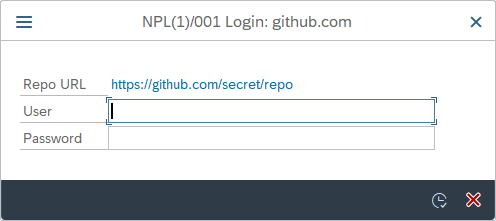

Online projects may require authentication to create branches or commits on the remote or even fetch the content in case of private repositories. Since abapGit uses git over HTTP the authentication mechanism is Basic Authentication (RFC 7617) using username and password. If the remote requires authentication for an action a popup will appear to enable the user to provide the necessary data. Once authentication is successful the session remains intact until abapGit is restarted.

## Two factor authentication

Most git hosts allow for two factor authentication. Relevant for abapGit is how to authenticate with 2FA enabled on the command line when using git over HTTP. This is usually done using a token which can be used instead of the normal password. Check the documentation of your git host on how to do this in detail ([GitHub](https://docs.github.com/en/github/authenticating-to-github/accessing-github-using-two-factor-authentication#using-two-factor-authentication-with-the-command-line), [GitLab](https://docs.gitlab.com/ee/user/profile/personal_access_tokens.html), [Bitbucket](https://support.atlassian.com/bitbucket-cloud/docs/app-passwords/), [Azure DevOps](https://docs.microsoft.com/en-us/azure/devops/organizations/accounts/use-personal-access-tokens-to-authenticate)). Note that the username might be different from your normal one when using the token as the password.

## Using a password manager

To store passwords or tokens you might want to use a password manager. To enable autofill you can match the window title of the entry to the following pattern:

`NPL(*)/001 Login: github.com`

Note the part `NPL(*)/001` only appears if you have `Show system name in taskbar button` enabled in the SAP GUI options.

## Using a custom authentication mechanism

You can use the exit `CREATE_HTTP_CLIENT` to implement a different authentication yourself by returning an already authenticated http client instance. See the [exit documentation](ref-exits.html#create_http_client) for examples.

## Security considerations

abapGit intentionally does not provide a way to store login data across sessions. This is because SAP systems are multi-user-systems and since abapGit is mostly used by developers on shared development systems who have extensive authorizations any approach to store passwords runs the risk of getting abused. On local single user systems you can easily implement the exit mentioned above to permanently store the login data in a RFC destination. Otherwise a password manager is the recommended approach to store login data. (See discussion in [#3798](https://github.com/abapGit/abapGit/issues/3798))
