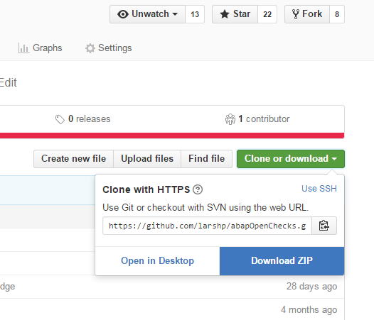

1: Run report ZABAPGIT via SE38 or SA38

2: Click "+ Offline"

3: Enter project name eg. "abapOpenChecks", and an empty package eg. "$AOC"

4: Download the zip archive containing the git files, eg. https://github.com/larshp/abapOpenChecks/archive/master.zip

On github there is a link to download repository contents as zip:

5: Click "Import ZIP" in abapGit

6: Choose file downloaded in step 4
