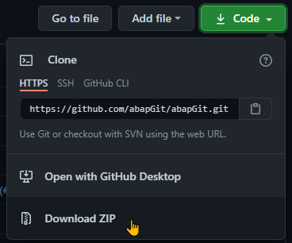

## Summary ##
abapGit exists in 2 flavours: _standalone_ version or _developer_ version.

  * The standalone version is targeted at users. It consist of one (huge) program which contains all the needed code. You run the standalone version in transaction `SE38`, executing the program you created.
  * The developer version is targeted at developers contributing to the abapGit codebase. It consists of all the ABAP programs/classes/interfaces/etc. of the abapGit project. You run the developer version with transaction `ZABAPGIT`.

## Prerequisites ##
abapGit requires SAP BASIS version 702 or higher.

## Install Standalone Version ##
1. Download the [ABAP code](https://raw.githubusercontent.com/abapGit/build/main/zabapgit.abap) (right click -> save-as) to a file.
2. Via `SE38` or `SE80`, create a new report named `ZABAPGIT_STANDALONE` (formerly `ZABAPGIT_FULL`). Note: Do *not* use the name `ZABAPGIT` if you plan to install the developer version.
3. In source code change mode, upload the code from the file using Utilities -> More Utilities -> Upload/Download -> Upload
4. Activate

Typically, abapGit will only be used in the development system, so it can be installed in a local `$` package (e.g.  `$ZABAPGIT`).

Now you can use abapGit by executing the report in transaction `SE38`.

## Install Developer Version ##

In order to contribute to the abapGit project, you install the developer version. First, logon to your SAP system in English (language **EN**) and install the standalone version (see above).

### Online (Recommended)

Prerequisite to using the online feature is that [SSL must be setup](guide-ssl-setup.html). If your system is not connected to the Internet (e.g. behind a firewall) or doesn't allow proper SSL configuration, then you can use the offline scenario (see below).

1. Run the standalone version of abapGit
1. On the repository overview page, select "New Online"
1. Enter `https://github.com/abapGit/abapGit/` for the URL
1. Enter package name `$ABAPGIT` (or select an existing or create new package)
1. Select "Clone Online Repo"
1. Select "Pull"

Transaction `ZABAPGIT` is now available to run the developer version.

### Offline

Download latest version of the abapGit developer version from https://github.com/abapGit/abapGit/. Select **Code** > **Download ZIP** and save the file locally.

1. Run the standalone version of abapGit
1. On the repository overview page, select "New Offline"
1. Enter repo name `abapGit` and package name `$ABAPGIT` (or select an existing or create new package)
1. Select "Create Offline Repo"
1. Select "Import zip"
1. Select the *abapGit-main.zip* file
1. Select "Pull zip"

Transaction `ZABAPGIT` is now available to run the developer version.
