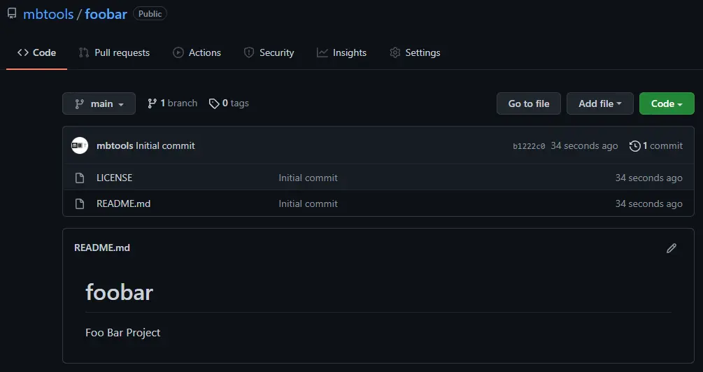
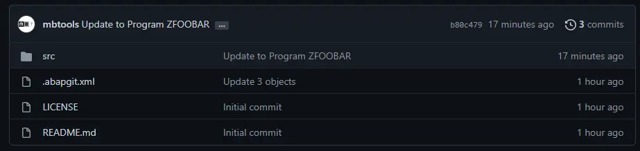

You have an existing package in your system that you want to copy to a new git repository:

Initialize the git repository, make sure it is not emtpy (typically you add README and LICENSE files from a template):

## New Repository

In abapGit, create a repository via the "New Online" button:

The existing objects will show up in the worklist making it possible to commit the objects to the git repository:

## Stage and Commit

Select "Stage", "Add All and Commit", and finally "Commit" to transfer all changes to your git repository. For details, see 
[Committing changes to git](https://docs.abapgit.org/guide-stage_commit.html).

Now your local abapGit repo and the remote git repository are in sync. 

You can view the updated repository, which will contains a [.abapgit.xml](https://docs.abapgit.org/settings-dot-abapgit.html) file
and a `/src/` folder with all your objects. 

