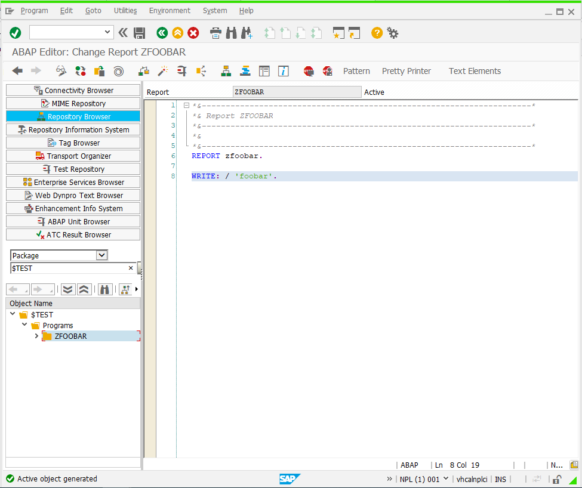
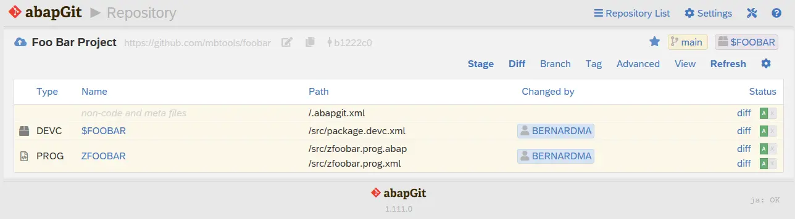
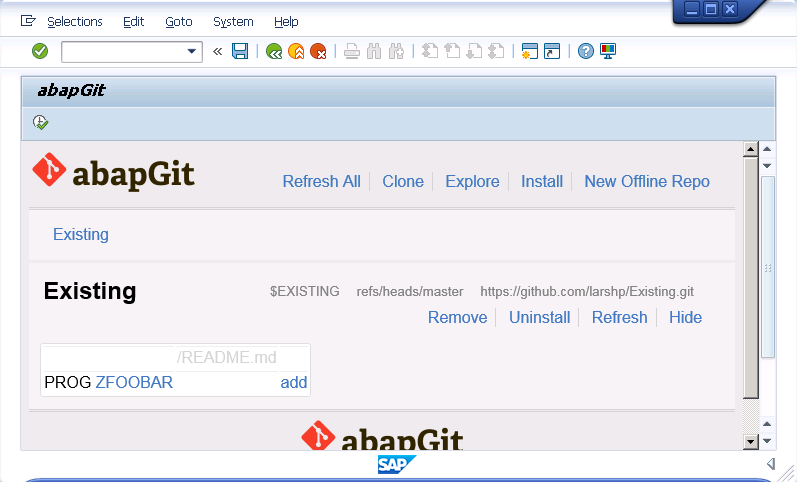

You have an existing package in your system that you want to copy to a new git repository:

Initialize the git repository, make sure it is not emtpy:

In abapGit, clone the repository via the +Online button:

The existing objects will show up in the worklist making it possible to commit the objects to the git repository:

