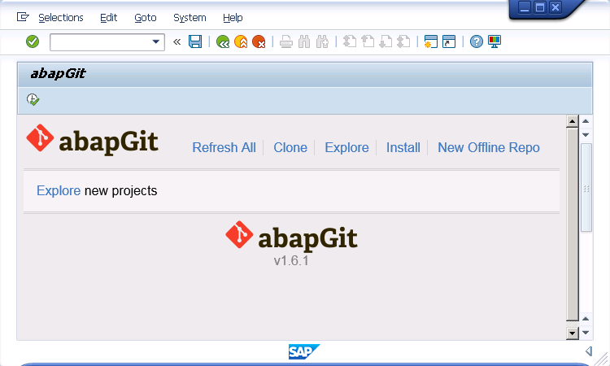
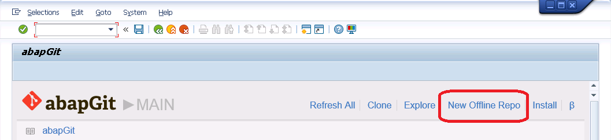
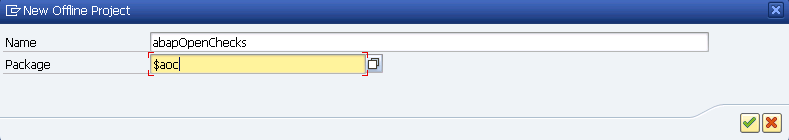
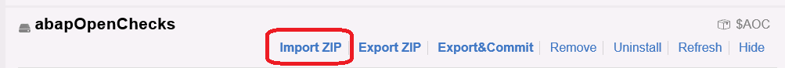

* Start ZABAPGIT

* Select "New Offline"

* Enter the name for your project, eg "Datamatrix" along with a package name, eg. $DATAMATRIX. If the package does not exist yet, it will be created automatically when pulling. Alternatively, you can select "Create Package" to create the package manually with your own settings.

* Select "Create Offline Repo"

* Now you have a new offline repository. You can add your own objects to the package or import objects via a ZIP file.
