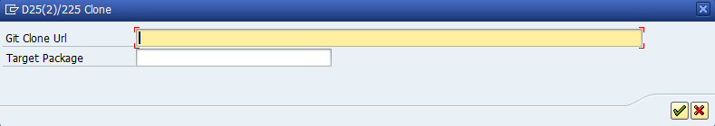
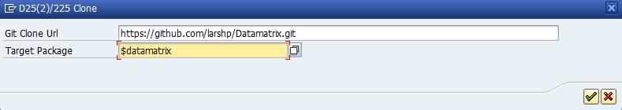
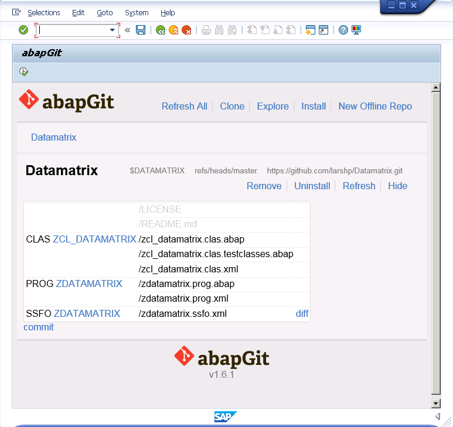

* Start ZABAPGIT

* Click on "New Online"

* Enter the url for the github project, eg https://github.com/larshp/Datamatrix.git along with a package name, eg. $DATAMATRIX. If the package does not exist yet, you can click on "Create package" to create it.

* Click ok

* Click "Pull" to copy all objects from the git repository into the SAP system

