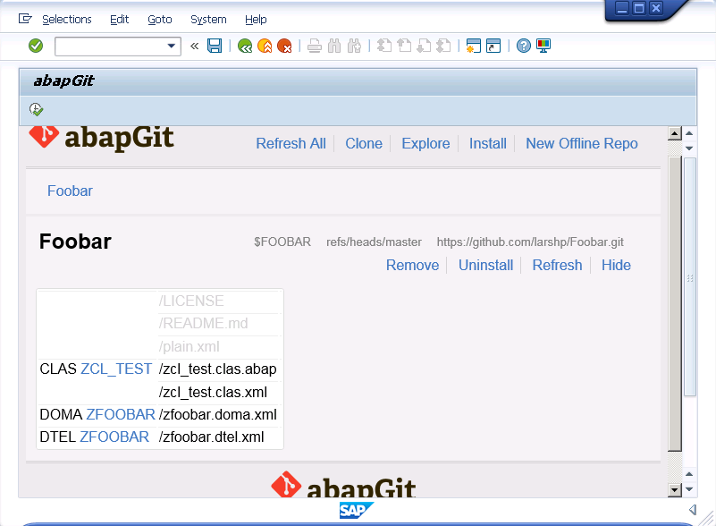
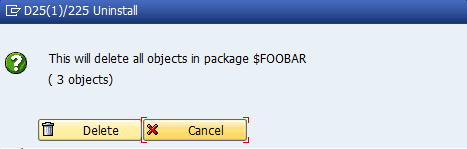

* Start ZABAPGIT
* Navigate to the repository

* Click the "uninstall" link

* It will now delete all objects in the package specified when installing the repository.

In contrast to "Uninstall" clicking the "remove" button deletes the reference between the git repository and the ABAP package but does not uninstall the associated ABAP package from the system.
