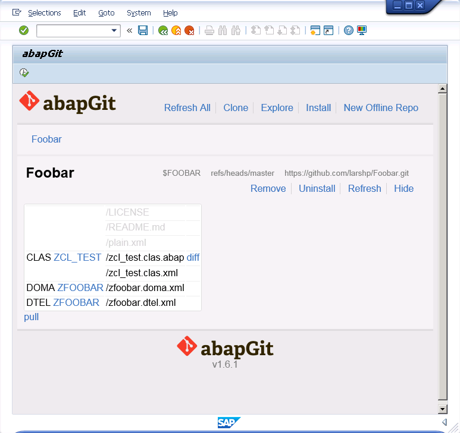
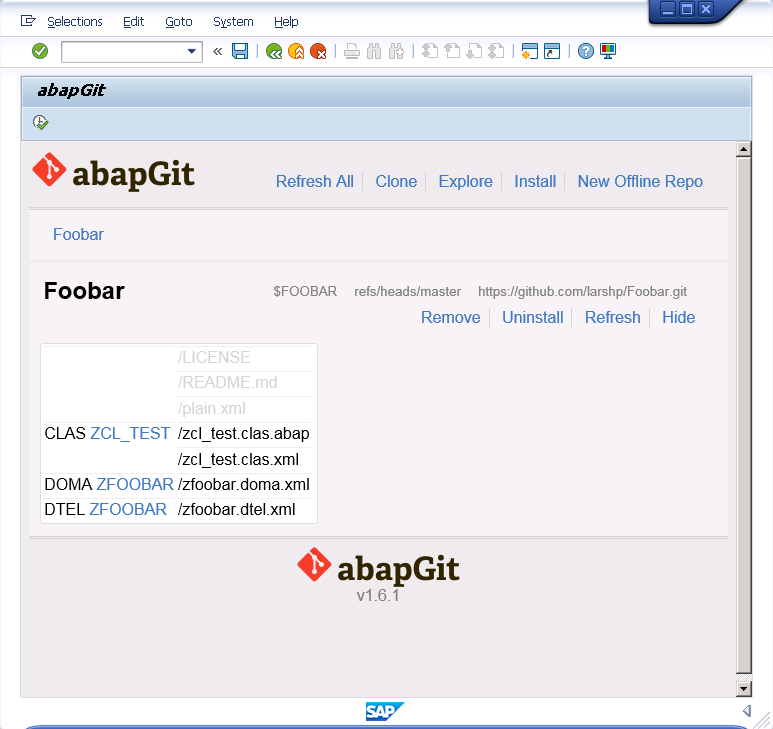

* Start ZABAPGIT, it will automatically compare local and remote code. If code is updated in the remote repository a "pull" link will appear

* Click the "pull" link and it will update the local code

* After the update, no links should appear,

