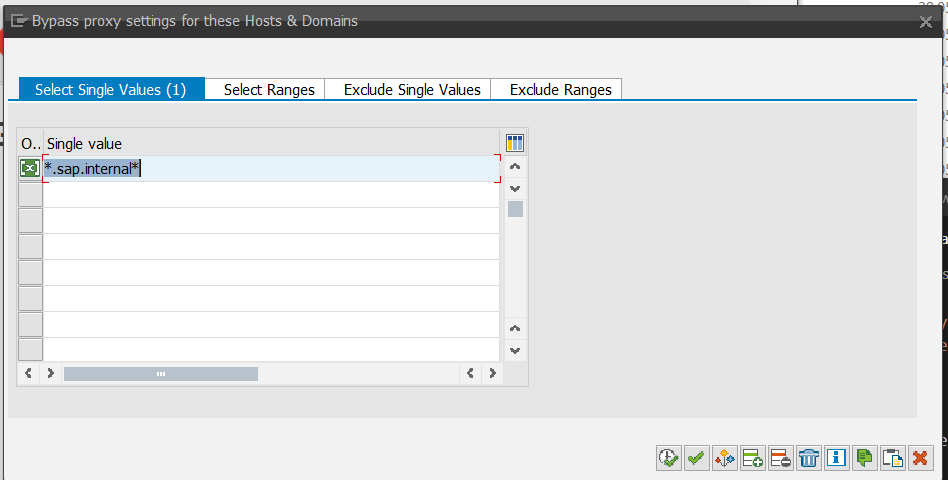

Online projects only

If your server is behind a proxy, it can be configured under Advanced -> Settings,

**Hint:** the URL must **not contain https://** -> just enter name or IP

When the proxy should not be used for all repositories, exceptions can be maintained.

**Hint:** the  whole repository URL is checked against these bypass entries