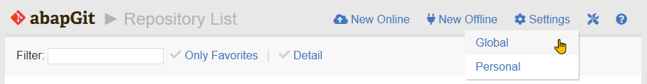
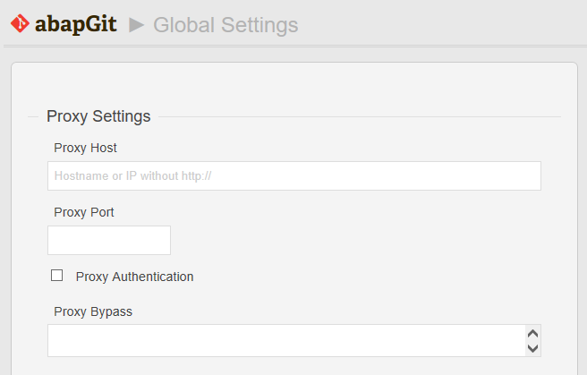
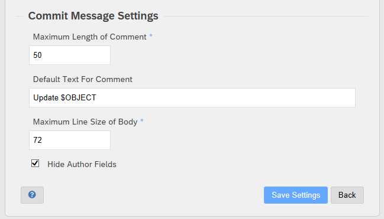
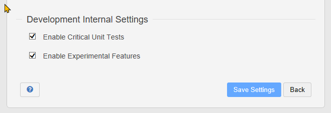

Global settings in abapGit are valid system-wide and for all users. You can maintain the settings from the repository list or repository view by selecting "Settings > Global".

Note: Global settings are relevant for online projects, only.

## Proxy Settings

If your server is behind a proxy, you can maintain the proxy host and port here. Do not enter any "http://" or "https://" prefix for the proxy host. Just enter the host name
or its IP address.

If your proxy requires you to login, set the proxy authentication flag. Then abapGit will prompt you for your proxy user and password, when an online connection is required.

In case the proxy should not be used for all repositories, exceptions can be maintained. Enter each exception on a separate line. Patterns are allowed,
for example "*.sap.internal*".

## Commit Message Settings

Each commit to an online repository requires a commit message. The corresponding settings define the maximum length for the comment (message header) and body. Defaults are set
to 50/72 according to the "[Rule of Well Formed Git Commit Messages](https://www.midori-global.com/blog/2018/04/02/git-50-72-rule)".

You can also maintain a default for the comment. Variables $OBJECT and $FILE will be replaced by the number of objects or files contained in the commit.

## Development Internal Settings

Note: These settings are only available when using the [Development Version](https://docs.abapgit.org/guide-development-version.html) of abapGit.

### Enable Critical Unit Tests
The developer version of abapGit might contain unit tests that impact system settings (like creating/deleting test objects). By default, these test are disabled.

### Enable Experimental Features
There might be features that are not completely implemented or tested yet but already included in the developer version. By default, these features are disabled.

