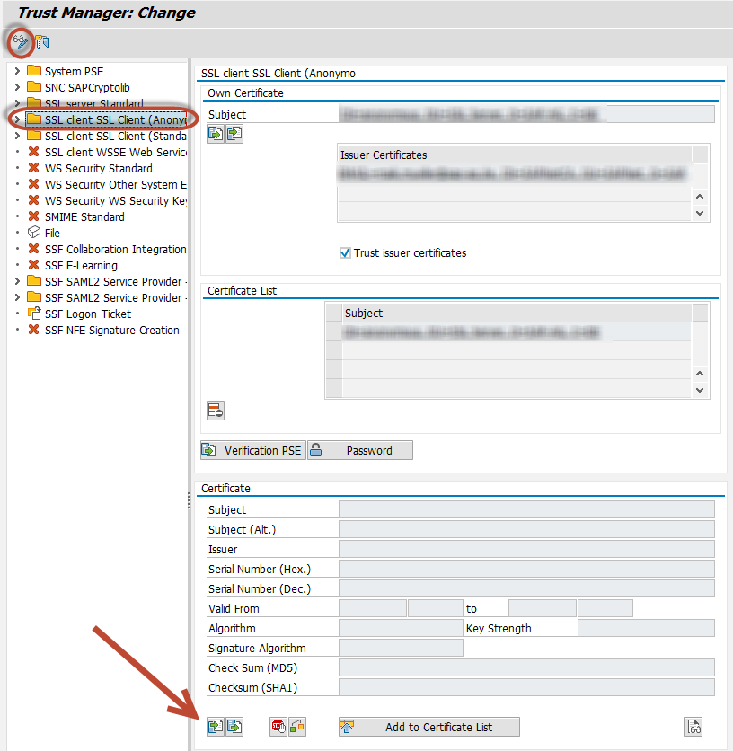
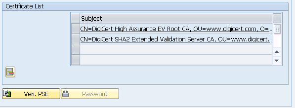

### Downloading the certificate file

##### Option A - Chrome #####
1. On chrome, go to [https://github.com](https://github.com)
2. Click on the locker near the address bar, then click on "Details"
3. The developer tools will open at the Security tab. Click on "View certificate"
4. Go to the "Details" tab and click on "Copy to file..." to export to a .CER file
5. Open the "Certification path" tab and navigate to the parent node at the tree, do this until the root

##### Option B - Firefox #####
1. Use Firefox to go to [https://github.com](https://github.com)
2. Click on the lock icon and then "More Information ..." and there "View Certificate"
3. Switch to the Details Tab and choose the first certificate of the tree and click Export
4. Do the same for the next certificate in the tree

##### Option C - Manual #####
1. Goto github, find the certificate that it is using
2. Download certificate from [https://www.digicert.com/digicert-root-certificates.htm](https://www.digicert.com/digicert-root-certificates.htm)

### Installing the certificate file

1. Install the certificates in STRUST transaction:
* Click on the Change button
* Open "SSL client Client SSL Client (Anonymous)" folder
* In the third box, Certificate, click on the bottom-left button "Import certificate" and "Add to certificate list".
* Upload all the downloaded certificates
* Save



Report [ZABAPGIT_TEST_SSL](./other-test-ssl.html) can be used to verify that the connection works.

Also see the following blog posts on SCN:
* [Calling WebServices from ABAP via HTTPS/SSL with pfx certificates](http://scn.sap.com/people/jens.gleichmann/blog/2008/10/31/calling-webservices-from-abap-via-httpsssl-with-pfx-certificates)
* [BSP a Developer’s Journal Part XIV – Consuming WebServices with ABAP](http://scn.sap.com/people/thomas.jung/blog/2004/11/17/bsp-a-developers-journal-part-xiv--consuming-webservices-with-abap)

The certificate list should end up looking something like this:


### Note on actions that require authentication
To perform operations that require authentication, like e.g. cloning a private or pushing to any GitHub repository, you need to install not only the certificates for github.com but also for [https://**api**.github.com](https://api.github.com). Repeat the download and STRUST import steps as described in the sections above accordingly. (See also [Issue#1491](https://github.com/abapGit/abapGit/issues/1491))

### Note about GitHub
On [2018-02-22](https://githubengineering.com/crypto-removal-notice/), GitHub deprectated weak TLS connections.

See [SAP note 510007](https://launchpad.support.sap.com/#/notes/510007), section 7, for information on how to configure SSL.

Add profile parameters:
```
ssl/client_ciphersuites = 150:PFS:HIGH::EC_P256:EC_HIGH
ssl/ciphersuites = 135:PFS:HIGH::EC_P256:EC_HIGH
icm/HTTPS/client_sni_enabled = TRUE
```

To add profile parameters use transaction RZ10 or update contents of file DEFAULT.PFL directly. For [preview, evaluation and developer versions of SAP NetWeaver](https://go.support.sap.com/minisap/#/minisap) refer to following locations, depending on your system name:
- "A4H - SAP NetWeaver AS ABAP 7.4 and above (Linux / SAP HANA)" - /usr/sap/A4H/sys/profile/DEFAULT.PFL
- "NPL - SAP NetWeaver 7.x" - /sapmnt/NPL/profile/DEFAULT.PFL
