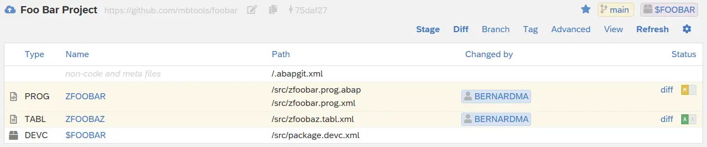
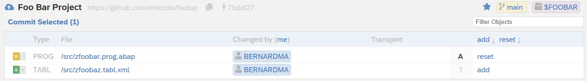
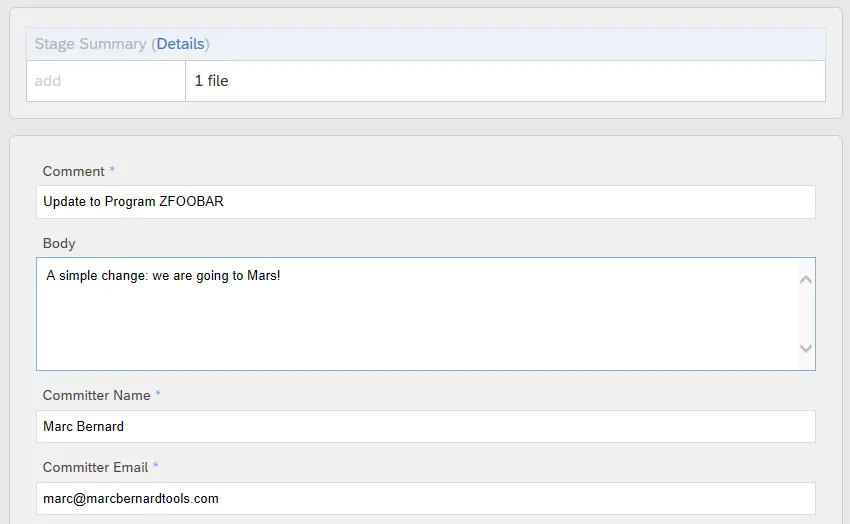
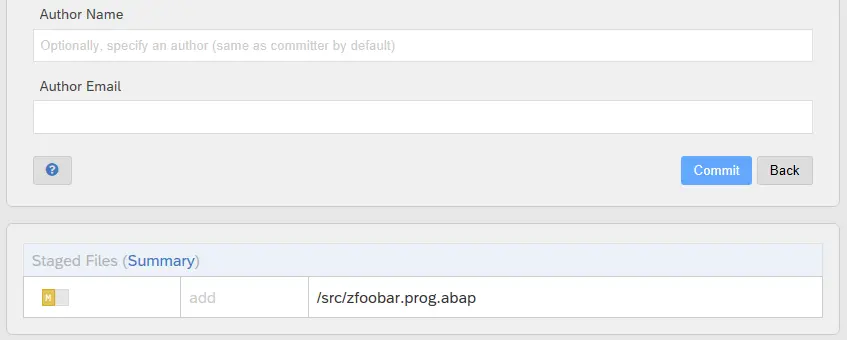
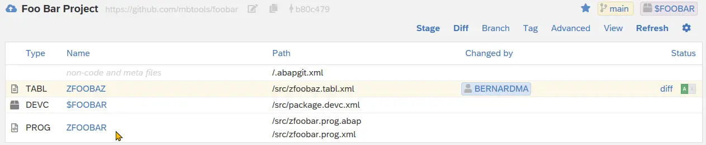

When you have made changes to your local objects, you can stage and commit them to your git repository (also called "push").

Changes are shown highlighted in the repository view. Each changed file is marked with a diff status depending on the type of change. 

Note: Always, check that you are on the correct URL (original or fork) and branch, before continuing. 

## Stage

Select "Stage" to collect the changed files into a staging area. All changed files are listed with their corresponding status. 

In order to commit any change to your repo, you can either select "Add All and Commit" or pick individual files using the action links to the right
and click "Commii Selected".

You can "add", "remove" or "ignore" files. "Add" will update the file on git or create it if it doesn't exist yet. "Remove" will drop the file from git. 
"Ignore" will include the file in the [ignore list](https://docs.abapgit.org/settings-dot-abapgit.html) without changing it in git. 

## Commit

Before any changes are transferred to your git repository, you can review them on the "Commit Page". At the top you get a summary of how many files will
be added, remove, or ignored. You find list of files at the bottom.

For each commit, you have to enter three mandatory fields: "Comment", "Committer Name", and "Committer Email". Optionally, you can enter a longer
description of your changes in "Body". Or you may enter an "Author Name" and "Author Email" if it's different from the committer (i.e. the current user).

When you select "Commit", your git repository will be updated. 

abapGit will update the local state of the objects and return to the repository view. Objects that were committed are now listed as unchanged (i.e. identical 
to the definition in git).

