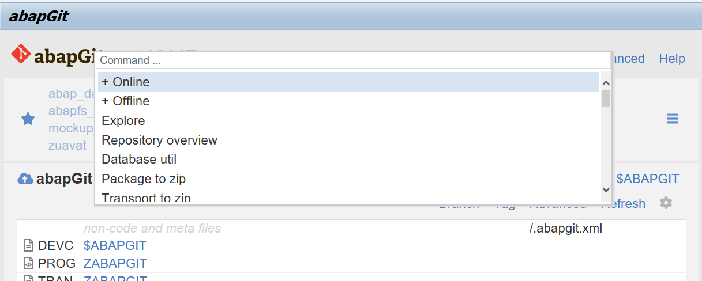

abapGit UI has several unobvious but convenient features

## Command palettes

Command palettes is a popular UI control available in modern editors like Sublime, VSCode, Atom and etc - this is a control called usually by `Ctrl+p` or `F1` combinations.

Command palettes are available:

- in the main page (repository overview), on `F1` key, to call a command from toolbars in the screen (new repo, pull, state, advanced commands ...)
- in the main page (repository overview), on `F2` key, to go to arbitrary installed repo instead of choosing it from favorites or full list
- *todo - at diff page*

## To do

- keyboard navigation
- keyboard shortcuts
- news ??
- repo list page (it is unobvious that it exists)
- stage file-by-file selection ?
- stage patch
- main page repo list settings (files only ...)
- ...