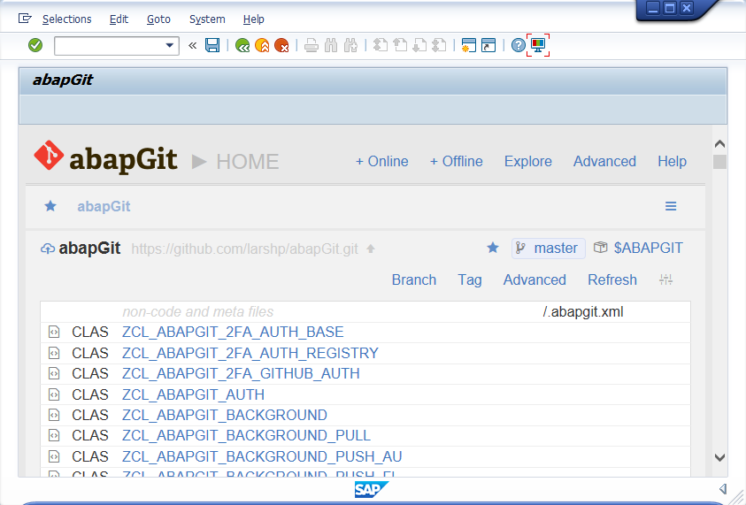

abapGit is a git client for ABAP developed in ABAP. It requires SAP BASIS version 702 or higher.

Latest build: [zabapgit.abap](https://raw.githubusercontent.com/abapGit/build/master/zabapgit.abap)

For questions/comments/bugs/feature requests/wishes please create an [issue](https://github.com/larshp/abapGit/issues)

### Security
abapGit is a tool to import and export code between ABAP systems. If a developer have a developer key to the system,
the developer can perform these actions already. abapGit enables the developer to do mass export/changes/imports but
not more than already possible to do manually.

Running automated security checks on the abapGit code will by design give a lot of errors, as abapGit will import, overwrite and change
ABAP artifacts in the system in ways that might not be intended. Always review all code in remote repositories before importing to the target system,
this is possible because abapGit is plain text unlinke traditional transport files.

That being said, abapGit is used by mutiple [organizations](https://docs.abapgit.org/other-where-used.html), all abapGit
changes are reviewed via pull requests. And all 100+ [repository watchers](https://github.com/larshp/abapGit/watchers) are
automatically notified for every change to the code base, so potentially all changes are looked at by more people than
tradtional enterprise products.

### Support
It is a community effort to support the project, recommend [watching](https://help.github.com/articles/watching-and-unwatching-repositories/) the project to get a feeling about issue resolution. Everyone can suggest changes to abapGit via [pull requests](https://help.github.com/articles/about-pull-requests/).

