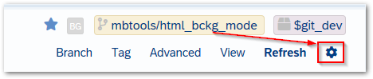
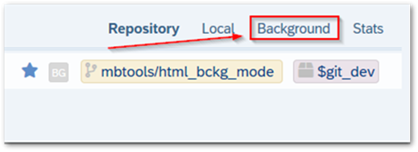
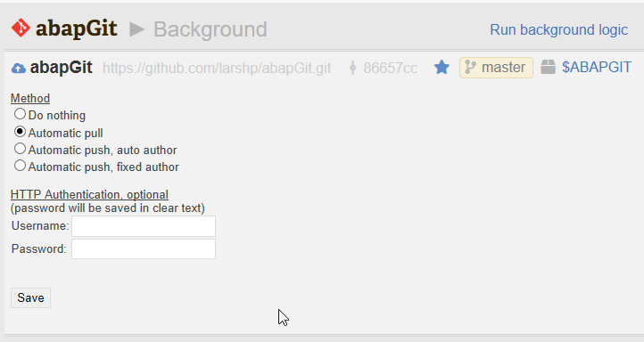
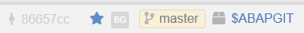
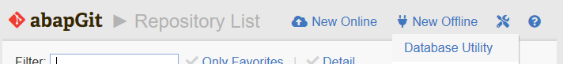
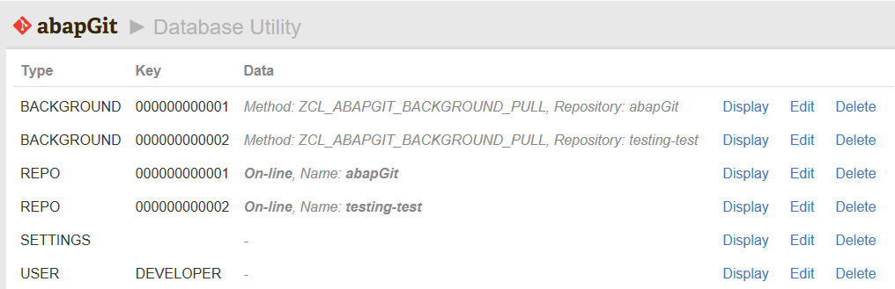

abapGit can pull or push in background mode. This setting has to be activated on the repository-level.

### Activating Background Mode
* Navigate to a repository, go to the repository settings and select "Background":

* Here you can define the action that will be executed in background mode, by default the setting is "Do Nothing". 

* To activate an automatic pull for a repository, select "Automatic pull". After saving, a background icon will appear next to the branch name

* You can run the action immediately by clicking on "Run background logic". Note: this will execute the background logic for **ALL** repositories with background mode enabled.

### Overview 

* To get an overview of all repositories that have background mode enabled, navigate from the Repository List to "Settings" -> "Database Utility"

* The relevant repositories will have the type "BACKGROUND".

### Defining a Job

* To periodically run the background logic, you can define a job with transaction `SM36`.
* Create a step for program `ZABAPGIT` (or `ZABAPGIT_STANDALONE`, depending on which version of abapGit you are using). This will execute all defined background activities.
* You can check the log of the job with transaction `SM37`