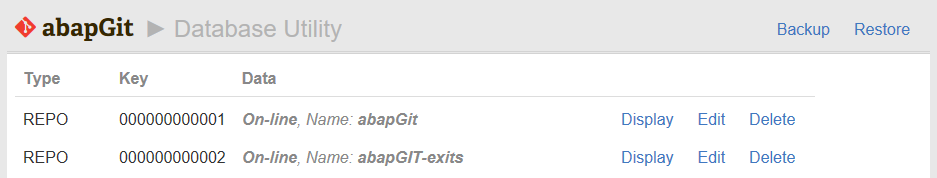
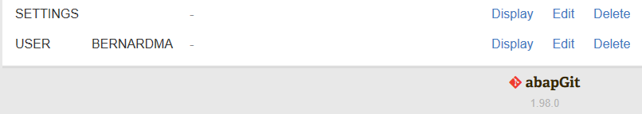
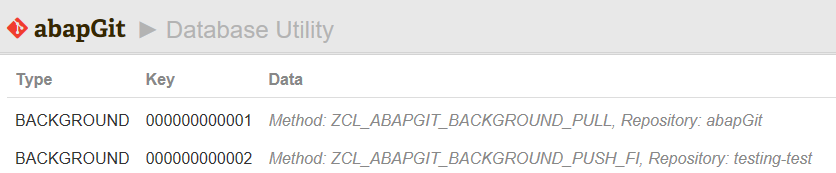
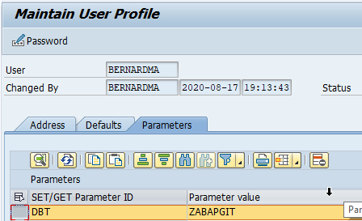

`Database Util` is a tool for managing database entries created by abapGit. You can access the tool via the tools icon in the top right corner of the abapGit home page > choose first menu item `Database Util`.

It's possible to edit database entries of type

- `SETTINGS`
- `USER`
- `REPO`
- `BACKGROUND`

Be careful when you edit these entries from within abapGit. Corrupting the XML or setting invalid options might break your abapGit!





## Global Settings

The `SETTINGS` entries contain global (not user-specific) settings for your abapGit installation. This is an example:

```xml
<?xml version="1.0" encoding="utf-16"?>
<abapGit version="v1.0.0">
 <asx:abap xmlns:asx="http://www.sap.com/abapxml" version="1.0">
  <asx:values>
   <SETTINGS>
    <PROXY_URL>myproxy.com</PROXY_URL>
    <PROXY_PORT>8080</PROXY_PORT>
    <PROXY_AUTH>X</PROXY_AUTH>
    <PROXY_BYPASS>
     <item>
      <SIGN>I</SIGN>
      <OPTION>EQ</OPTION>
      <LOW>dont.use.proxy.com</LOW>
     </item>
    </PROXY_BYPASS>
    <COMMITMSG_COMMENT_LENGTH>50</COMMITMSG_COMMENT_LENGTH>
    <COMMITMSG_COMMENT_DEFLT>Update $OBJECT</COMMITMSG_COMMENT_DEFLT>
    <COMMITMSG_BODY_SIZE>72</COMMITMSG_BODY_SIZE>
   </SETTINGS>
  </asx:values>
 </asx:abap>
</abapGit>
```

## User Settings

A `USER` entry contains meta information like the favorites of an user and their repository configurations e. g. name and email address for Git. This is an example of a `USER` entry:

```xml
<?xml version="1.0" encoding="utf-16"?>
<asx:abap xmlns:asx="http://www.sap.com/abapxml" version="1.0">
 <asx:values>
  <USER>
   <DEFAULT_GIT_USER>
    <NAME/>
    <EMAIL/>
   </DEFAULT_GIT_USER>
   <REPO_SHOW/>
   <HIDE_FILES/>
   <CHANGES_ONLY/>
   <SHOW_ORDER_BY/>
   <DIFF_UNIFIED/>
   <FAVORITES>
    <item>000000000001</item>
    <item>000000000002</item>
    <item>000000000003</item>
   </FAVORITES>
   <REPO_CONFIG>
    <item>
     <URL>https://[...]/file.git</URL>
     <LOGIN>my_username</LOGIN>
     <GIT_USER>
      <NAME>First and Last Name</NAME>
      <EMAIL>email@example.com</EMAIL>
     </GIT_USER>
     <LAST_CHANGE_SEEN/>
    </item>
    <item>
     <URL>https://[...]/file.git</URL>
     <LOGIN>my_second_user</LOGIN>
     <GIT_USER>
      <NAME>First and Last Name</NAME>
      <EMAIL>email@example.com</EMAIL>
     </GIT_USER>
     <LAST_CHANGE_SEEN/>
    </item>
   </REPO_CONFIG>
   <SETTINGS>
    <MAX_LINES>0</MAX_LINES>
    <ADT_JUMP_ENABLED/>
    <SHOW_DEFAULT_REPO/>
    <LINK_HINTS_ENABLED/>
    <LINK_HINT_KEY/>
    <HOTKEYS/>
    <PARALLEL_PROC_DISABLED/>
    <ICON_SCALING/>
    <UI_THEME/>
    <HIDE_SAPGUI_HINT/>
   </SETTINGS>
  </USER>
 </asx:values>
</asx:abap>
```

## Repository Meta Data

The `REPO` entries contain meta data like Git repository URL, branch and package information and information about files known and to be excluded. This is an example:

```xml
<?xml version="1.0" encoding="utf-16"?>
<asx:abap xmlns:asx="http://www.sap.com/abapxml" version="1.0">
 <asx:values>
  <REPO>
   <URL>https://[...]/file.git</URL>
   <BRANCH_NAME>refs/heads/my_branch</BRANCH_NAME>
   <PACKAGE>Z_MY_PACKAGE</PACKAGE>
   <CREATED_BY>my_user</CREATED_BY>
   <CREATED_AT>20200418201549.200418</CREATED_AT>
   <DESERIALIZED_BY>my_user</DESERIALIZED_BY>
   <DESERIALIZED_AT>20200507134505.184445</DESERIALIZED_AT>
   <OFFLINE/>
   <LOCAL_CHECKSUMS>
    <item>
     <ITEM>
      <OBJ_TYPE/>
      <OBJ_NAME/>
      <DEVCLASS/>
      <INACTIVE/>
     </ITEM>
     <FILES>
      <item>
       <PATH>/</PATH>
       <FILENAME>.abapgit.xml</FILENAME>
       <SHA1>[...]</SHA1>
      </item>
     </FILES>
    </item>
    <item>
     <ITEM>
      <OBJ_TYPE>DEVC</OBJ_TYPE>
      <OBJ_NAME>Z_MY_PACKAGE</OBJ_NAME>
      <DEVCLASS>Z_MY_PACKAGE</DEVCLASS>
      <INACTIVE/>
     </ITEM>
     <FILES>
      <item>
       <PATH>/src/</PATH>
       <FILENAME>package.devc.xml</FILENAME>
       <SHA1>[...]</SHA1>
      </item>
     </FILES>
    </item>
    <item>
     <ITEM>
      <OBJ_TYPE>DEVC</OBJ_TYPE>
      <OBJ_NAME>Z_ANOTHER_PACKAGE</OBJ_NAME>
      <DEVCLASS>Z_ANOTHER_PACKAGE</DEVCLASS>
      <INACTIVE/>
     </ITEM>
     <FILES>
      <item>
       <PATH>/src/abaplinted_sample/</PATH>
       <FILENAME>package.devc.xml</FILENAME>
       <SHA1>[...]</SHA1>
      </item>
     </FILES>
    </item>
    <item>
     <ITEM>
      <OBJ_TYPE>PROG</OBJ_TYPE>
      <OBJ_NAME>Z_MY_REPORT</OBJ_NAME>
      <DEVCLASS>Z_ANOTHER_PACKAGE</DEVCLASS>
      <INACTIVE/>
     </ITEM>
     <FILES>
      <item>
       <PATH>/src/abaplinted_sample/</PATH>
       <FILENAME>z_my_report.prog.abap</FILENAME>
       <SHA1>[...]</SHA1>
      </item>
      <item>
       <PATH>/src/abaplinted_sample/</PATH>
       <FILENAME>z_my_report.prog.xml</FILENAME>
       <SHA1>[...]</SHA1>
      </item>
     </FILES>
    </item>
   </LOCAL_CHECKSUMS>
   <DOT_ABAPGIT>
    <MASTER_LANGUAGE>E</MASTER_LANGUAGE>
    <STARTING_FOLDER>/src/</STARTING_FOLDER>
    <FOLDER_LOGIC>PREFIX</FOLDER_LOGIC>
    <IGNORE>
     <item>/.gitignore</item>
     <item>/LICENSE</item>
     <item>/README.md</item>
     <item>/package.json</item>
     <item>/.travis.yml</item>
     <item>/.gitlab-ci.yml</item>
     <item>/abaplint.json</item>
     <item>/azure-pipelines.yml</item>
     <item>/src/.gitkeep</item>
    </IGNORE>
    <REQUIREMENTS/>
   </DOT_ABAPGIT>
   <HEAD_BRANCH/>
   <LOCAL_SETTINGS>
    <DISPLAY_NAME>My Test Repository</DISPLAY_NAME>
    <IGNORE_SUBPACKAGES/>
    <WRITE_PROTECTED/>
    <ONLY_LOCAL_OBJECTS/>
    <CODE_INSPECTOR_CHECK_VARIANT>ZMY_CHECK_VARIANT</CODE_INSPECTOR_CHECK_VARIANT>
    <BLOCK_COMMIT>X</BLOCK_COMMIT>
    <SERIALIZE_MASTER_LANG_ONLY/>
   </LOCAL_SETTINGS>
  </REPO>
 </asx:values>
</asx:abap>
```

If you remove a repository entry from the database util, the repository is not shown in abapGit anymore. This is useful for example if you want to remove a repository which has a non-existing package assigned and thus can't be opened and deleted normally.

## Background

The `BACKGROUND` entries show the method and the repository key for which the background action will be executed:



The respective XML file contains the method and optionally the credentials needed for a push:

```xml
<?xml version="1.0" encoding="utf-16"?>
<asx:abap xmlns:asx="http://www.sap.com/abapxml" version="1.0">
 <asx:values>
  <DATA>
   <METHOD>ZCL_ABAPGIT_BACKGROUND_PULL</METHOD>
   <USERNAME/>
   <PASSWORD/>
   <SETTINGS/>
  </DATA>
 </asx:values>
</asx:abap>
```


## Emergency Mode

On rare occasions, it is necessary to edit the abapGit settings to overcome an issue.

This enhancement allows you to start abapGit in "emergency mode", which directly shows the "Database Util" for you to view or edit any setting.

How to start abapGit in "Emergency Mode":

1. Go to transaction SU3 to maintain your user profile
1. Maintain parameter DBT with value "ZABAPGIT" (all-caps)
1. Start abapGit which will launch the "Database Util"
1. Make necessary changes and save
1. After exiting abapGit, go back to SU3 and remove parameter DBT


