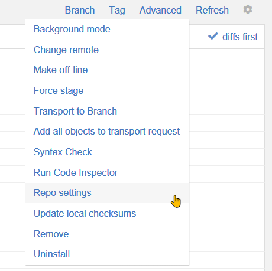
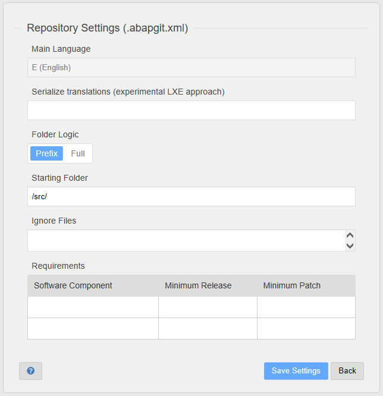
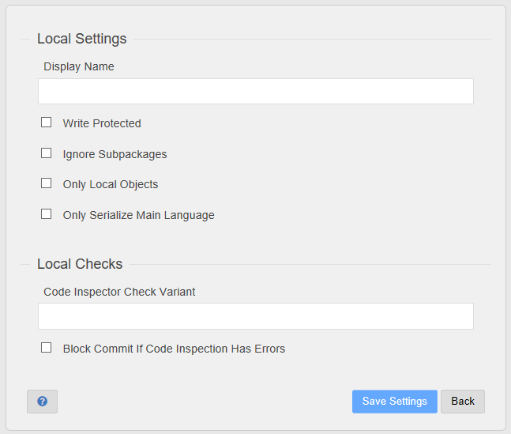

**.abapgit.xml** is a special abapGit file. It contains meta information of the abapGit project.

It is recommended to edit .abapgit.xml via "Repo menu > Advanced > Repo settings". 
(In exceptional cases, you could edit the xml directly via "abapGit menu > Advanced > Database util".)



Example: abapGit's own .abapgit.xml

```xml
<?xml version="1.0" encoding="utf-8"?>
<asx:abap xmlns:asx="http://www.sap.com/abapxml" version="1.0">
 <asx:values>
  <DATA>
   <MASTER_LANGUAGE>E</MASTER_LANGUAGE>
   <STARTING_FOLDER>/src/</STARTING_FOLDER>
   <FOLDER_LOGIC>PREFIX</FOLDER_LOGIC>
   <IGNORE>
    <item>/.travis.yml</item>
    <item>/CONTRIBUTING.md</item>
    <item>/LICENSE</item>
    <item>/README.md</item>
    <item>/package.json</item>
    <item>/changelog.txt</item>
    <item>/.gitignore</item>
    <item>/CODE_OF_CONDUCT.md</item>
    <item>/abaplint.json</item>
    <item>/.eslintrc.yaml</item>
   </IGNORE>
  </DATA>
 </asx:values>
</asx:abap>
```

# Repository Settings

The following settings are stored in the repository and therefore valid for all users.



## Location
The `.abapgit.xml` file must be located in the root folder of the git repository.

## Master Language

The language in which all documentation and dictionary elements texts will be created. Follows SAP `sy-langu` values. Note that this implies that all objects in a repository will/should have the same master language.

## Starting Folder

The Git repository folder that defines the root folder where deserialization starts.

## Folder Logic

abapGit follows two folder logics: PREFIX and FULL.

### PREFIX

A package name must contain its parent package name as a prefix. Examples:

Valid prefix:
* ZFOO
  * **ZFOO**_BAR
    * **ZFOO_BAR**_QUX

will produce folder structure /bar/qux/

Invalid prefix:
* ZFOO
  * ZBAR

The folder logic PREFIX allows to install a repository into a different parent package (in different systems). This can even be local packages (`$*`), in which case no transport order is required.

### FULL

Any package name is accepted.

* ZSOMETHING
  * ZHELLO

will produce folder structure /zsomething/zhello/

The folder logic FULL forces the installation of a repository into packages with exactly the same name. Note that this can be problematic for contributors who use a system where specific prefixes for the package names are to be used.

## Ignore files

Files which abapGit will not download to your ABAP system. Typically, this includes references to readme, changelog, and license 
files as well as repository configuration related to workflows like build or linting jobs.

## Requirements

In this section, you can specify the minimum requirements that should be fulfilled to allow installation of the repository. Listed software components should exist in the target system and be at the given release or higher. If the target system matches the minimum release, then it must also be at the given patch level or higher.

# Local Settings

The following settings are stored in and valid for the current system only. 



## Display name

This setting overwrites the default name of the repository (which is derived from the later part of the repository URL).

## Write protected

If you write protect a repository, it will make sure that users cannot overwrite objects in the SAP system with objects from the  repository. It helps enforcing that data can only go from the SAP system to the repository.

Turning on this option disables pulls, uninstall of all objects, switching branches, etc.

Caution: The option influences only processes within abapGit. It does **not** protect against changes to objects using other means like ABAP Workbench or ABAP Development Tools. 

## Ignore subpackages

This setting impacts how abapGit determines which objects belong to a repository. The default is to select all objects assigned to the root SAP package including any other subpackages (and subpackages of subpackages). If "ignore subpackages" is turned on, then only objects of the root package are selected.

## Only local objects 

This setting impacts how abapGit determines which objects belong to a repository. If "only local objects" is turned on, then the selection is limited to objects assigned to the current system (tadir-srcsystem = sy-sysid).

## Code inspector

The repository objects can be checked with the [Code inspector](https://help.sap.com/viewer/ba879a6e2ea04d9bb94c7ccd7cdac446/7.5.18/en-US/49205531d0fc14cfe10000000a42189b.html) or [ABAP Test Cockpit (ATC)](https://help.sap.com/viewer/ba879a6e2ea04d9bb94c7ccd7cdac446/7.5.18/en-US/62c41ad841554516bb06fb3620540e47.html) before staging. It's possible to perform a code inspector or ABAP Test Cockpit check without maintaing a check variant. In this case the end user is prompted with a F4 search help to choose a check variant during runtime.

### Code inspector check variant

By entering a Code inspector or the ABAP Test Cockpit check variant, the check is activated. Only global check variants are supported. Thus the check variant has to be available to all developers. A check variant can either make use of local checks of the developer system or a reference to a check variant on a remote ABAP Test Cockpit system. The available checks in a check variant on a remote ATC system may differ from the available checks of a check variant of the developer system due to the ATC system being on a newer release. For more details about release-specific availability of ABAP Test Cockpit security-related checks delivered by SAP Code Vulnerability Analyzer (CVA) see SAP Note [1921820](https://launchpad.support.sap.com/#/notes/1921820).

### Block commit/push if code inspection has erros

This option can be used to prevent staging if errors of priority 1 and 2 were found during the Code Inspector or ABAP Test Cockpit  check. Findings of priority &ge; 3 are not reported. A check variant must be configured to activate this option. abapGit won't change its behavior based on the transport settings of the `Transport Tool Integration` of the ATC setup in transaction `ATC`. If this option is not active and errors were found, the end user can stage anyway. It's not possible to view or request exemptions from within abapGit during the staging process. Furthermore it's not able to access the ATC check documentation for a finding from within abapGit.

## Serialize master language only

By default, abapGit will serialize objects in all installed languages. If this option is turned on, then this process is limited to the master language defined in the repository settings (see above). 
