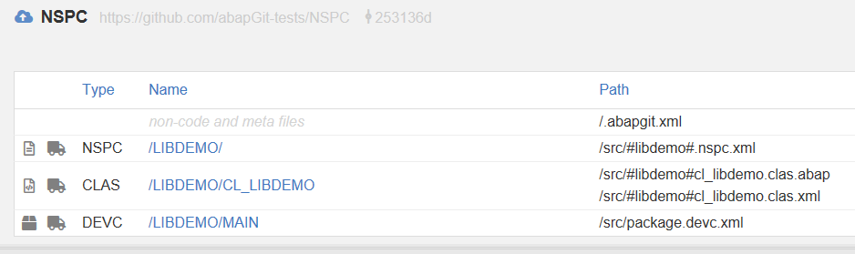

abapGit supports namespaces. Objects with namespaces are serialized, for example `/FOOBAR/REPORT` to `#foobar#report.prog.abap`. The namespace itself is serialized as `#foobar#.nspc.xml`, which contains the repair license key (but *not* the developer license key).

If a repo uses a namespace that does not exist in the local system yet, abapGit will automatically create the namespace when pulling from the repo.

Example:

Alternatively, you can create the namespace manually, of course:

A: Create namespace in SE03, namespace role = C, and add the repair license

B: Open namespace for modifications in SE03

C: Create namespaced package

D: Change package original system to current in SE03 -> Change Object Directory Entries

E: Clone/pull like normal

Objects will appear as repaired in the customer system, compare with git source to determine if the objects are modified.
