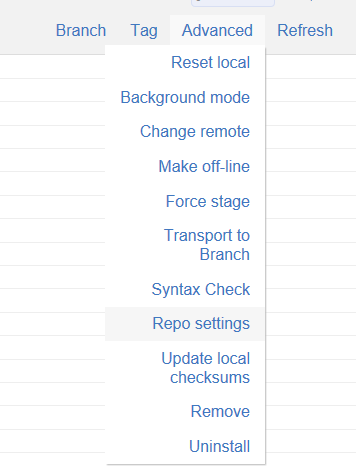

The write protected repository feature will make sure users cannot overwrite objects in the SAP system with objects from the git repository. So it helps enforcing that data can only go from the SAP system to the Git repository.

The feature disables pulls, uninstall of all objects, switching branches etc.

To enable:

In the repo, click "Repo settings"

Tick "Write protect"

Click "Save"