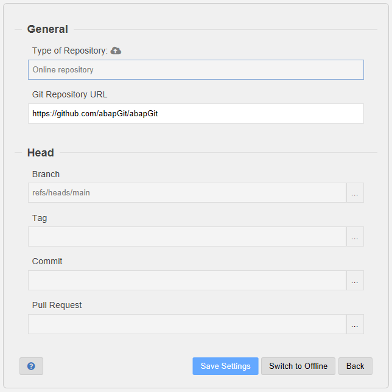
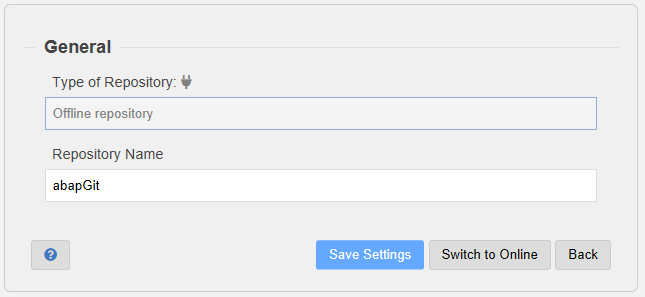

## Remote Settings

The following settings define the remote source of the abapGit repository. You can also switch the type of repository between "online" and "offline". 

Note: Changing the remote settings will *not* impact any objects in your system. If you want the system to reflect the changes, then you have to pull them into your system after saving the settings.

### Online Repositories

Online repositories are specified by the URL. The URL can point to the original repository or a fork of one.

The head of the repository used by abapGit can be defined in one of four ways:
- Branch 
- Tag
- Commit
- Pull Request

To change to a different head, simply use one of the value helps and save the settings.

The default setting is to use the main or default branch of the repository (`refs/heads/main`).

### Offline Repositories

You can change the name of offline repositories that is shown in the abapGit repository overview.
